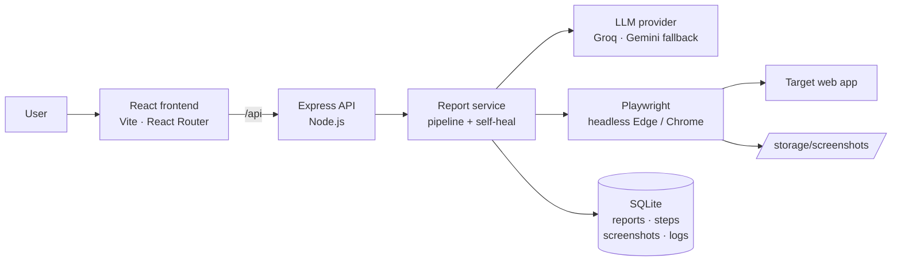

# 🐞 ReproAI

**From vague bug reports to verified Playwright tests.**

ReproAI turns a plain-English bug report like *"I answered every quiz question correctly but my score shows 0"* into a runnable Playwright script. It then **runs that script in a real browser** and proves the bug with step-by-step screenshots.

> Built in 24 hours at **Wonders of AI 4.0**, Kalasalingam Academy of Research and Education (KARE).
> Problem statement **WO-099: Synthetic Bug Repro Tool** · Team **Veridyn** (Team 102)

<!-- Optional: replace the link below with your demo video, or delete this line -->
<!-- ▶ **[Watch the 2-minute demo](https://your-demo-link)** -->

### ✨ Highlights

- 🧠 **Plain English → runnable Playwright script** in about 10–40 seconds
- 🎯 **Grounded in the real page**: the AI only uses buttons and fields that actually exist
- ✅ **Proves the bug**: runs the script in a real browser, with a screenshot for every step
- 🔁 **Self-healing**: fixes its own broken scripts and never weakens the final check
- 🛡️ **Doesn't cry wolf**: control cases confirm it reports "Not reproduced" when the app works
- 📋 **Actionable output**: download the `.spec.js`, re-run it, or copy it as a GitHub issue
- 🔌 **Provider-agnostic AI**: Groq first, with automatic fallback to Gemini

<!-- Save a screenshot of a "Bug reproduced" result as docs/screenshot.png -->


---

## The problem

Non-technical users describe bugs vaguely, e.g. "submit didn't work". Before a developer can fix a bug, they have to **reproduce** it, which means guessing the exact page, clicks, inputs and expected result. That guesswork costs hours, and many real bugs end up closed as *"cannot reproduce"*.

## Our solution

ReproAI automates the whole reproduction loop:

1. **Describe:** the user types the bug in plain English and gives the app URL.
2. **Scan:** Playwright opens the real page and captures its accessibility tree, the list of real buttons, fields and text.
3. **Generate:** an LLM turns the report into structured steps plus Playwright code, using **only elements that actually exist** on the page.
4. **Run:** every step executes in a headless browser, and each step gets its own screenshot and log line.
5. **Self-heal:** if a *script* problem breaks the run (a wrong selector or a timing issue), the AI rewrites the script from a fresh snapshot and retries, up to 3 times. It is never allowed to weaken the final check.
6. **Verify:** a final assertion of the *correct* behaviour decides the verdict.
   - **Bug reproduced:** the assertion failed in the way the user reported.
   - **Not reproduced:** every step passed and the app behaved correctly.

The result is a downloadable `.spec.js` file, a verdict, screenshots, logs, and a one-click GitHub-issue export.

### What makes it different

Most AI tools stop at *generating* test code, which often doesn't run. ReproAI differs in three ways:

- It **grounds** the AI in the live page, so selectors aren't invented.
- It **executes** the script and **proves** the result with screenshots.
- It **heals** its own script failures while keeping the user's actions and the expected behaviour intact.

---

## Expected MVP coverage

| MVP requirement | Where it lives |
|---|---|
| User input and configuration module | Dashboard form (bug description, target URL, framework) with validation |
| Core generation / processing engine | `reproai-backend/src/services`: scan → generate → run → self-heal → verify |
| Results view with actionable output | Verdict banner, detected steps, highlighted script (copy / download / re-run), expected vs actual, screenshots, logs, GitHub-issue export |
| Demo dataset / simulation and basic evaluation | `demo-app` (an EdTech app with planted bugs), `dataset/bugs.json` (7 bugs + 2 controls), `npm run eval`, and the Analytics page |

---

## Architecture



**Request flow:** `routes → controller → report.service → gemini.service + playwright.service → report.repo → SQLite`

---

## Tech stack

| Layer | Technology |
|---|---|
| Frontend | React 19, Vite, React Router, react-icons, plain CSS |
| Backend | Node.js (22.13+), Express 5 |
| AI | Groq (`openai/gpt-oss-120b`) with automatic Gemini fallback |
| Browser automation | Playwright (uses the installed Microsoft Edge or Chrome) |
| Database | SQLite, built into Node.js (`node:sqlite`), so there is nothing to install |

---

## Repository structure

```
ReproAI/
├── reproai-backend/
│   ├── src/
│   │   ├── config/          # env settings
│   │   ├── controllers/     # HTTP handlers
│   │   ├── db/              # SQLite connection + schema
│   │   ├── middleware/      # validation, error handling
│   │   ├── repositories/    # all SQL queries
│   │   ├── routes/          # API routes
│   │   ├── services/        # AI, Playwright, report pipeline
│   │   └── utils/           # script builder, errors
│   ├── demo-app/            # EduLearn demo app with planted bugs
│   ├── dataset/bugs.json    # evaluation cases
│   └── scripts/             # check, test-api, eval
└── reproai-frontend/
    └── src/
        ├── Components/      # layout, verdict, results, screenshots…
        ├── pages/           # Dashboard, History, Report Details, Analytics, Settings
        └── styles/
```

---

## Getting started

### Prerequisites

- **Node.js 22.13 or newer**
- **Microsoft Edge** or **Google Chrome** installed
- A free **Groq API key** ([console.groq.com](https://console.groq.com/keys)) and, optionally, a **Gemini API key** ([aistudio.google.com](https://aistudio.google.com/apikey))

### 1. Backend

```bash
cd reproai-backend
npm install
cp .env.example .env        # Windows: copy .env.example .env
```

Open `.env` and add your keys:

```env
PORT=8080
DEMO_PORT=8081
LLM_PROVIDER=groq
GROQ_API_KEY=your_groq_key
GROQ_MODEL=openai/gpt-oss-120b
GEMINI_API_KEY=your_gemini_key
GEMINI_MODEL=gemini-3.8-flash
BROWSER_CHANNEL=msedge
MAX_ATTEMPTS=3
RUN_TIMEOUT_MS=120000
```

Check the setup, then start the server:

```bash
npm run check     # Node, database, browser and AI provider should all show OK
npm start         # API on :8080, demo app on :8081
```

### 2. Frontend (in a second terminal)

```bash
cd reproai-frontend
npm install
npm run dev       # http://localhost:5173
```

### 3. Try it

1. Open **http://localhost:5173**.
2. Click a demo bug such as **"Quiz score is 0"**.
3. Click **Generate Playwright Script**.
4. In 10–40 seconds you'll see the verdict, steps, script, screenshots and logs.

---

## Demo app and dataset

`reproai-backend/demo-app` is **EduLearn**, a small EdTech app with bugs planted on purpose, so every result can be checked against a known answer:

| Case | Page | Planted bug |
|---|---|---|
| B1 | Quiz | Score is always 0 |
| B2 | Courses | Search is case-sensitive |
| B3 | Progress | Progress goes past 100% |
| B4 | Checkout | Coupon applies 90% off instead of 10% |
| B5 | Courses | Enrolling twice duplicates the course |
| B6 | Login | Wrong password still logs in |
| B7 | Profile | Saving the profile wipes the bio |
| C1, C2 | Login, Courses | **Controls:** features that work correctly, to catch false positives |

### Evaluation

With the backend running, open another terminal:

```bash
cd reproai-backend
npm run eval
```

This runs all 9 cases and reports:

- **Script validity:** runs that reached a verdict without a script error
- **Reproduction rate:** planted bugs correctly reproduced
- **Verdict accuracy:** results that match the known answer, including the controls
- **Average attempts** (self-healing) and **average time per bug**

The results also appear on the **Analytics** page.

#### Results

<!-- Replace every X with the numbers from your own `npm run eval` run -->

| Metric | Result |
|---|---|
| Planted bugs reproduced | X / 7 |
| Correct verdicts (including controls) | X / 9 |
| Script validity | X % |
| Average attempts per bug | X |
| Average time per bug | X s |

---

## API

Base URL: `http://localhost:8080/api`

| Method | Route | Purpose |
|---|---|---|
| `POST` | `/generate` | `{ bugDescription, targetUrl }` → full report |
| `GET` | `/reports` | Report history |
| `GET` | `/reports/:id` | One report with steps, script, screenshots and logs |
| `DELETE` | `/reports/:id` | Delete a report and its screenshots |
| `POST` | `/reports/:id/run` | Re-run the saved script |
| `POST` | `/reports/:id/regenerate` | Generate a fresh script for the same bug |
| `GET` | `/analytics` | Totals and reports per day |
| `GET` | `/evaluation` | Latest evaluation results |
| `GET` | `/health` | Health check |

Screenshots are served from `http://localhost:8080/screenshots/<reportId>/step-N.png`.

---

## Known limitations

| Limitation | How we handle it |
|---|---|
| The AI may guess a wrong selector | It is grounded in the live accessibility snapshot, and the self-heal loop retries up to 3 times |
| Timing and dynamic pages | Playwright auto-waits, with per-step timeouts |
| The AI provider is busy or rate-limited | Automatic retries with backoff, then fallback to the second provider |
| Privacy | Only the page structure and the bug text are sent to the AI, never user data |
| Generated code runs on the server | Intended for test environments. Production use should run it in an isolated container |

## Future scope

- Chrome extension to report bugs straight from the page
- Jira and GitHub integration to create issues automatically
- Running reproduced bugs as regression tests in CI/CD
- Mobile app support with Appium
- Screenshot and voice bug reports

---

## Team Veridyn

- Arun Sandosh Subramaniam S S
- Dinesh Kumar D
- Aswak Hussain A
- Abdul Basith Rahman K
- Ashwin S

*Wonders of AI 4.0 · KARE · Problem statement WO-099*
